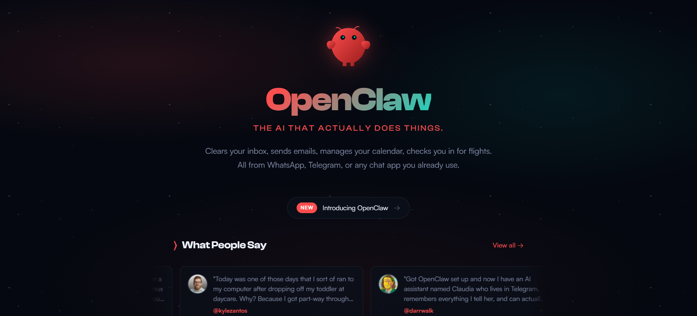
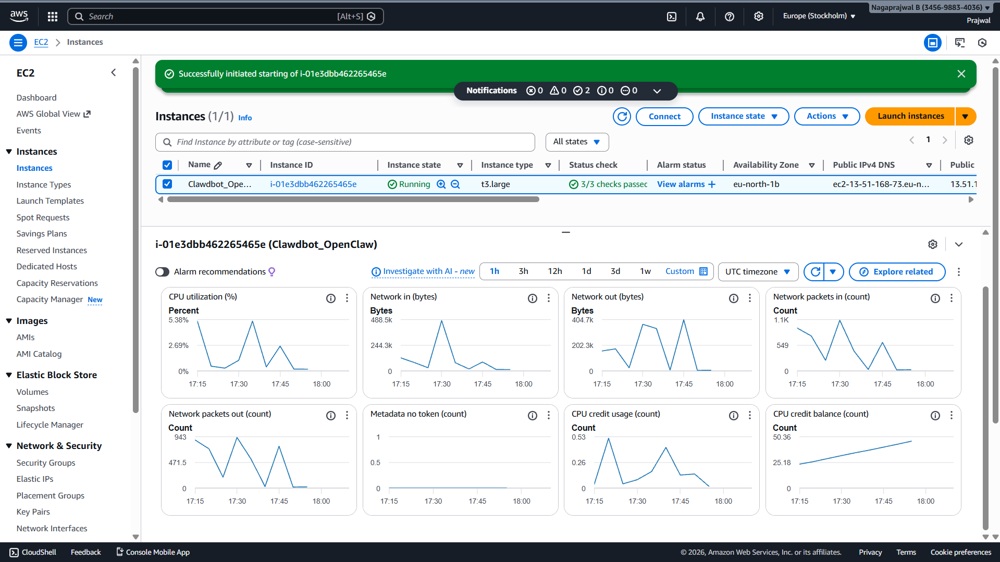
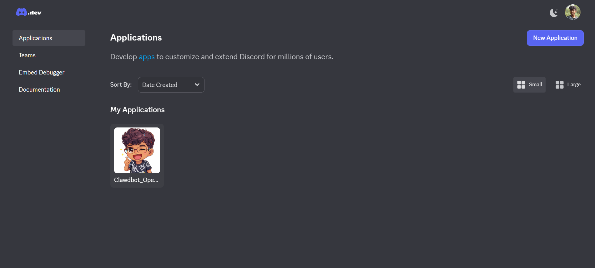
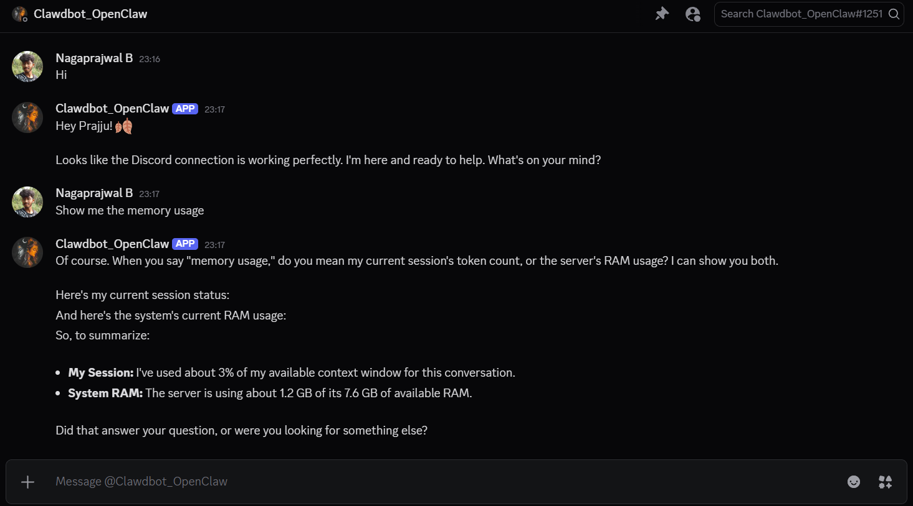

## Clawdbot (Moltbot) Deployment README
Clawdbot, now known as Moltbot, is a personal AI assistant that integrates with Discord and other channels, deployable on Ubuntu AWS EC2 instances. This README provides step-by-step instructions for hosting on Ubuntu, connecting to Discord, and running persistently
- WEBSITE NAME == ```https://openclaw.ai/ ```
- GEMINI API KEY [ or any AI ] == ``` <Your_APi_Key> ```
- Discord == ```<Token and Url>``` 
## Prerequisites :

* AWS account with EC2 access: ```Launch m5.large (2 vCPUs, 8 GiB RAM)``` to avoid pnpm OOM kills on free tier—steady performance for Node.js apps like Clawdbot.

* Ubuntu Server 24.04 LTS AMI (latest stable)

* Create/Download key pair (.pem)

* SSH key pair for EC2 access, make sure the port 22 is allowed in the AWS Security Groups 

* Discord application created at https://discord.com/developers/applications with a bot token (enable Message Content Intent)

## Setup Workflow of OpenClaw_Clawdbot : 
Connect via SSH: 
```
ssh -i "your-key.pem" ubuntu@<ec2-public-ip>
```

Update system and install essentials:
```
sudo apt update && sudo apt upgrade -your-key
```
```
sudo apt install curl -y
```

One-line Installation : 
Replace the multi-step Node.js/pnpm/moltbot commands with this official installer:

```
curl -fsSL https://openclaw.ai/install.sh | bash 
```

Verify Installation:
```
openclaw --version
```

Initial Setup (Onboarding Wizard): 
```
openclaw onboard --install-daemon
```
This sets up workspace (~/.clawdbot/), daemon (systemd user service), and prompts for:

* AI provider (e.g., Anthropic/OpenAI API key or OAuth).
* Channels : Select Discord, paste DISCORD_BOT_TOKEN.
* Workspace config (AGENTS.md, SOUL.md, etc.)

Start gateway (control plane, port 18789 localhost):
```
moltbot gateway --port 18789 --verbose
```

You can access the control UI in your browser (if you opened port 18789 in the firewall) at:
```
http://<EC2_PUBLIC_IP>:18789
```

## DISCORD SETUP 

To set up Discord for your Clawdbot (Moltbot) bot, create the application in the Discord Developer Portal, configure intents, and integrate the token into your OpenClaw config.

### Discord Developer Portal Steps
- Visit https://discord.com/developers/applications and click New Application.

- Name it (e.g., "Clawdbot"), create, then go to Bot tab > Add Bot > Yes, do it!.
​
- Under Token, click Copy or Reset Token (save securely; never share).

- Scroll to Privileged Gateway Intents: Enable Message Content Intent and Server Members Intent > Save Changes.

### Bot Invite to Server
- Go to OAuth2 > URL Generator: Select bot and applications.commands scopes.
​
- Permissions: View Channels, Send Messages, Read Message History, Embed Links, Attach Files, Use Slash Commands.

- Copy generated URL, open in browser, select your server, and authorize.

## Clawdbot Key Strengths
- Personal AI assistant with customizable agents for complex Discord conversations and workflows

- Multi-model support: Anthropic Claude, OpenAI, local models – choose based on cost/performance

- Production-ready daemon service with auto-restart, real-time metrics, persistent workspace

- Discord DMs + servers + webhooks/Slack for unified AI access across platforms

- Node.js CLI (moltbot onboard), hot-reload config, extensible agent architecture

## SnapShots








## AWS EC2 Hosting Advantages (vs Local)
### Security Benefits:

- Security Groups firewall blocks all ports except SSH – zero public Discord exposure

- IAM roles + Secrets Manager encrypt Discord/AI tokens with auto-rotation

- EBS encryption protects all chat history/data at rest

- CloudTrail audit logs track every access attempt

- GuardDuty threat detection alerts on suspicious activity

- Terminate instance = instant data wipe capability

### Privacy Benefits:

- Isolated VPC – your Discord conversations never touch SaaS platforms

- Tailscale VPN encrypts even SSH access end-to-end

- No local machine compromise risk exposes years of chat history

- Immutable AMIs prevent persistent malware

- No ISP/router can see your bot traffic

### Reliability Benefits:

- 99.99% EC2 uptime vs local power/internet outages

- Auto-scaling handles Discord traffic spikes

- CloudWatch metrics + alarms for instant issue detection

- Cross-region failover ready

```
Secure, observable, and always on—this is my baseline template for shipping AI assistants in production
```